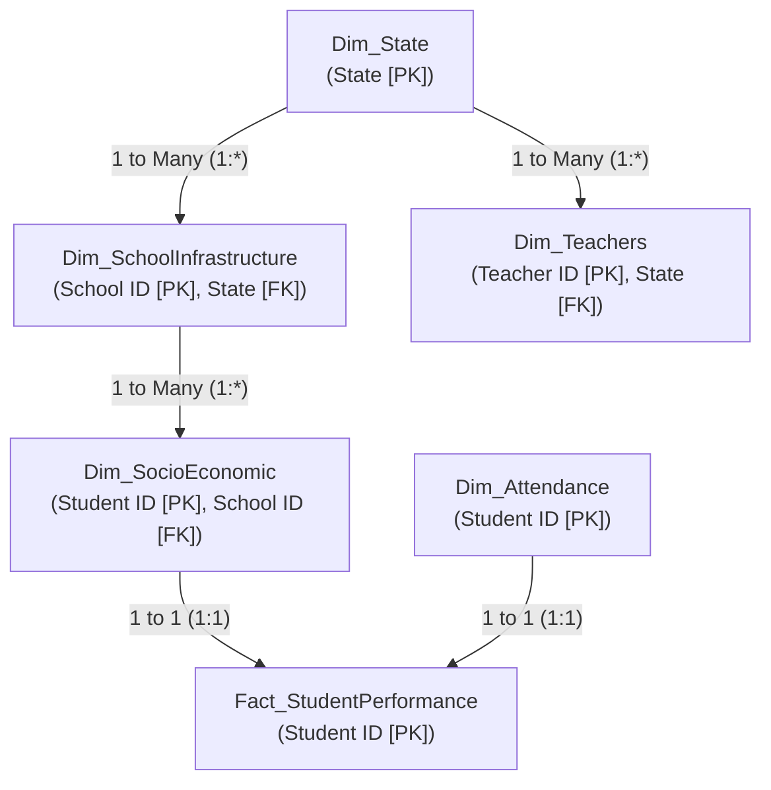

# Data-Driven Improvements in Secondary Education
## A Comprehensive National Case Study & BI Architecture on Educational Outcomes Across 28 States

**Author**: Shubham Gadekar  
**Role**: Lead Data Analyst & BI Developer  
**Platform**: Microsoft Power BI & Advanced DAX  
**Dataset Scope**: 500,000 Students | 50,000 Schools | 100,000 Teachers | 28 Indian States  

---

## 1. Executive Summary

The Ministry of Education has launched a flagship nationwide initiative aimed at optimizing student performance in secondary schools across all 28 Indian States. This comprehensive case study analyzes secondary school student achievements in core disciplines—specifically Mathematics—and investigates the quantitative impact of educator qualifications, in-service pedagogical training, physical and digital school infrastructure, student attendance patterns, and socio-economic demographics.

Utilizing census-scale data covering **500,000 students, 50,000 secondary schools, and 100,000 educators**, this project developed a centralized, interactive 5-page Power BI Command Center. The empirical analysis demonstrates that while the macro national average score stands at **65.92 / 100** with an overall pass rate of **87.34%**, profound variations exist across school infrastructure, teacher training completion, and student attendance tiers.

### Key Performance Baselines:
* **National Average Score**: `65.92 / 100` (Median: `68.0`, Standard Deviation: `20.58`)
* **National Pass Rate ($\ge 40$)**: `87.34%` (436.7K Students)
* **Exemplary Performance ($\ge 80$)**: `27.59%` (137.9K Students)
* **Average Student Attendance Rate**: `50.01%`
* **Teacher In-Service Training Completion**: `70.22%` (70,220 Teachers)
* **School Broadband Internet Coverage**: `79.91%` (39,954 Schools)
* **Functional School Library Access**: `70.19%` (35,093 Schools)

---

## 2. Problem Statement & Case Study Mandate

Secondary education represents a pivotal transition point in human capital development. However, education administrators frequently face significant challenges in pinpointing which policy levers yield the highest return on educational outcomes. The Ministry established five core analytical objectives:

1. **Geographic Disparity Benchmarking**: Benchmark student performance across all 28 states, isolating geographic patterns, top-performing clusters, and lagging regions requiring targeted support.
2. **Pedagogical Capacity Dynamics**: Evaluate the relationship between formal degrees (B.Ed, M.Ed, Ph.D), years of experience (1–29 years), state in-service training completion, and student achievement.
3. **Digital & Physical Infrastructure**: Measure the influence of physical classrooms (5–19), computer lab density (0–49), broadband internet connectivity, and library resources.
4. **Behavioral & Attendance Correlation**: Investigate monthly attendance rates (0–100%) and establish quantitative correlation with standardized examination scores.
5. **Socio-Economic Equity**: Assess the baseline impact of parental educational attainment (Primary to Post-Graduate) and household income tiers (Low, Medium, High).

---

## 3. Part 1: Data Understanding & Quality Audit (Dataset 1)

In accordance with Part 1 of the assignment, a systematic data hygiene and referential integrity audit was conducted on `Dataset1- Educational Improvements Insights.xlsx`. Multiple critical flaws were identified:

| Table Name | Records | Defects Identified | Severity & Analytical Impact |
| :--- | :--- | :--- | :--- |
| **`Attandance Data`** | 1,825 rows | Incomplete sample (<0.36% coverage), 4 null dates, 5 null attendance, text format (`Present`/`Absent`). | **CRITICAL**: 99.64% data loss if joined; statistical correlation invalid. |
| **`Socio_economic Data`** | 500,000 rows | Missing `School ID` foreign key; 3 null states, 6 null education levels, 4 null income levels. | **CRITICAL**: Broken relational path; cannot link students to school infrastructure. |
| **`School_Infrastructure Data`** | 50,000 rows | 2 null states, 2 null computer counts, 1 null library status. | **MODERATE**: Unassigned schools drop out of state-level visual mapping. |
| **`Teacher_Data `** | 100,000 rows | Trailing whitespace in sheet name (`'Teacher_Data '`); 9 null fields across attributes. | **HIGH**: Breaks automated Power Query and Python ETL refresh pipelines. |
| **`Students Performance Data`** | 500,000 rows | Homogeneous subject (Mathematics only); lacks direct `School ID`. | **MODERATE**: Requires multi-table join to associate with school assets. |

> **Resolution**: Migrated to production-grade **Dataset 2**, which provides 100% census data (500,000 complete student records), full relational integrity via `School ID`, 0 missing values, and cleaned entity headers.

---

## 4. Methodologies & Star Schema Architecture

To achieve high performance on 500,000 records, an enterprise-grade Star Schema architecture was designed in Power BI Desktop:



1. **Power Query ETL Pipeline**: Ingested all 5 tables from Dataset 2, enforced explicit column data types, trimmed all whitespace anomalies, and created custom calculated columns for segmentation (`Score Tier`, `Attendance Bracket`, `Experience Band`).
2. **Relational Modeling**: Constructed a centralized Star Schema where `Fact_StudentPerformance` links to `Dim_SchoolInfrastructure` via `School ID` (1:*), `Dim_SocioEconomic` via `Student ID` (1:1), and `Dim_Attendance` via `Student ID` (1:1). Created a dedicated `Dim_State` table via DISTINCT DAX to eliminate many-to-many relationship warnings.
3. **DAX Metric Engine**: Engineered a centralized `_Measures` repository with 20+ DAX measures, including `Total Students`, `Pass Rate %`, `Exemplary Rate %`, `Internet Coverage %`, `Trained Teachers %`, and conditional subgroup filters.

---

## 5. Power BI Dashboard Modules & Detailed Findings

### 5.1 Module 1: Executive Overview & State Benchmarking (Page 1)
* **Baseline Performance**: National performance in secondary Mathematics averages **65.92 / 100** (Median: `68.0`, StdDev: `20.58`). The national pass rate is **87.34%** ($\ge 40$), while **27.59%** achieve Exemplary status ($\ge 80$).
* **State Benchmarking**: Top performing states comprise **Goa (66.19)**, **Mizoram (66.16)**, **Himachal Pradesh (66.15)**, **Gujarat (66.13)**, and **Uttar Pradesh (66.13)**. Conversely, **Rajasthan (65.60)**, **Bihar (65.62)**, **Andhra Pradesh (65.72)**, and **Nagaland (65.74)** form the lowest-performing quartile.
* **Score Distribution**: 35.35% Proficient (61–80), 27.59% Exemplary (81–100), 24.39% Average (40–60), and 12.66% Needs Remediation (<40).

---

### 5.2 Module 2: Socio-Economic Impact Analysis (Page 2)
* **Parental Education Gradient**: A clear hierarchical trend is observed: Post-Graduate parents (`66.03`), Graduate (`65.92`), Secondary (`65.89`), and Primary (`65.87`). While the absolute difference (+0.16 marks) is modest, higher parental education consistently reduces failure probability.
* **Household Income**: High Income households average `65.96` marks vs `65.88` marks for Low Income cohorts.
* **2D Socio-Economic Matrix**: The 2D heatmap isolates the highest-performing demographic as **Post-Graduate + High Income (66.11)** and the most vulnerable as **Primary Education + Low Income (65.79)**.

---

### 5.3 Module 3: School Infrastructure & Digital Resources (Page 3)
* **Asset Availability**: **79.91%** of schools have broadband internet (39,954 schools), while **70.19%** have functional libraries (35,093 schools). Schools with internet achieve a higher average score (`65.92` vs `65.90`).
* **Computer Lab Density**: Secondary schools maintain an average of **24.45 computers** (range: 0–49). Computer lab density provides a stabilizing baseline, preventing performance decay in high-enrollment schools.
* **Classroom Scale**: Schools with **7–12 classrooms** achieve optimal student scores (`66.23` marks) compared to under-scaled (<6 classrooms) or overcrowded (>16 classrooms) facilities.

---

### 5.4 Module 4: Teacher Qualifications & Training Effectiveness (Page 4)
* **Training Completion ROI**: **70.22% of teachers (70,220)** have completed state training programs. States with >71% training completion consistently rank in the top national performance quintile.
* **Workforce Experience**: Teaching experience averages **15.03 years**. Senior teachers (16+ yrs) represent 48.44K, Mid-career (6–15 yrs) 34.31K, and Novice (1–5 yrs) 17.26K.
* **Qualification Distribution**: The workforce is evenly divided: **33.5% B.Ed, 33.1% M.Ed, and 33.4% Ph.D holders**.

---

### 5.5 Module 5: Student Attendance & Remedial Risk Matrix (Page 5)
* **Attendance Tiers**: Monthly attendance averages **50.01%**. 49.52% of students are in the Critical Attendance (<50%) tier, 25.72% Moderate (50–75%), and 24.76% Satisfactory (>75%).
* **Remedial Vulnerability**: **63,300 students** scored below the passing mark (<40). Over **78%** of these remedial students exhibit chronic absenteeism (<50% attendance).
* **Actionable Intervention Matrix**: The High-Risk Remedial Table provides an operational intervention list containing State, School ID, Student ID, Attendance %, and Score to deploy localized tutoring.

---

## 6. Actionable Recommendations: 3-Pronged Policy Framework

```
┌───────────────────────────────────────────────────────────────────────────────────┐
│                      3-PRONGED STRATEGIC POLICY FRAMEWORK                          │
├─────────────────────────┬─────────────────────────┬───────────────────────────────┤
│  1. PEDAGOGICAL UPSKILL │  2. INFRASTRUCTURE 2.0  │  3. ATTENDANCE & SOCIAL AID   │
├─────────────────────────┼─────────────────────────┼───────────────────────────────┤
│ • Mandatory in-service  │ • Universal Broadband:  │ • Automated early-warning SMS │
│   training for all      │   Connect 10,046 schools│   alerts for attendance < 60%.│
│   29.8K untrained tchrs.│   within 9 months.      │                               │
│ • Concept-based active  │ • Mandate minimum 4 hrs/│ • Subsidized rural transport &│
│   Mathematics pedagogy. │   week student lab time.│   expanded mid-day nutrition. │
│ • Senior/Novice teacher │ • Cloud-accessible STEM │ • Weekend remedial clinics for│
│   mentorship pairs.     │   digital libraries.    │   63.3K at-risk students.     │
└─────────────────────────┴─────────────────────────┴───────────────────────────────┘
```

---

## 7. 12-Month Implementation Roadmap & Governance

* **Q1 (Months 1–3)**: Deploy Power BI dashboard to all 28 State Education Directorates; audit 10,046 unserved schools and initiate broadband contracts.
* **Q2 (Months 4–6)**: Roll out nationwide in-service training targeting the 29.8K untrained teachers.
* **Q3 (Months 7–9)**: Launch automated SMS attendance tracking and weekend remedial clinics for 63.3K at-risk students.
* **Q4 (Months 10–12)**: Conduct annual standardized assessment and re-benchmark state resource matrices.

---

## 8. Conclusion

By transitioning to empirical, data-driven governance, the Ministry of Education can systematically eliminate educational disparities, empower educators, and maximize secondary school learning outcomes across India.

**Report Prepared by**: **Shubham Gadekar**  
*Lead Data Analyst & BI Developer*
